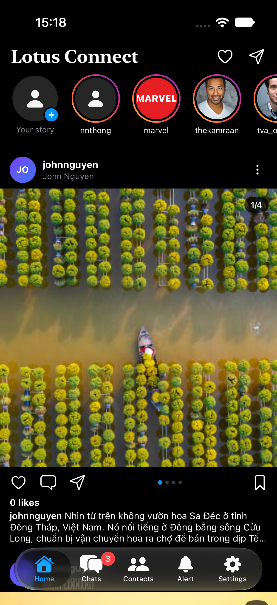
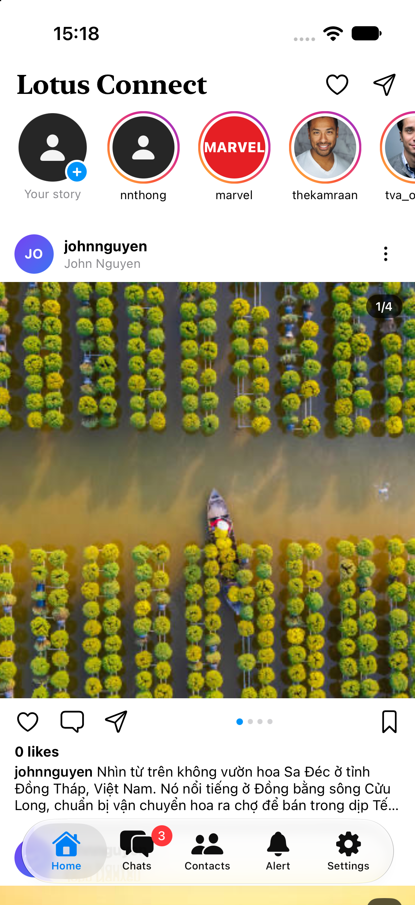
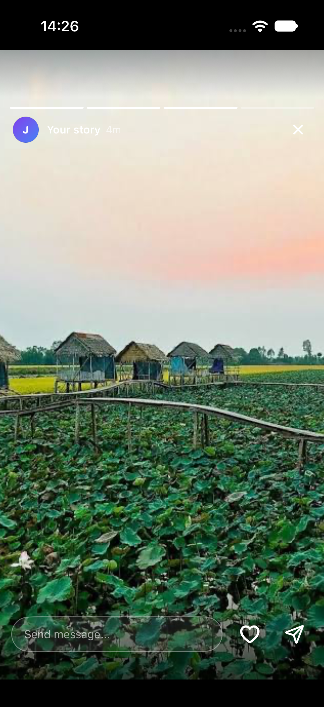
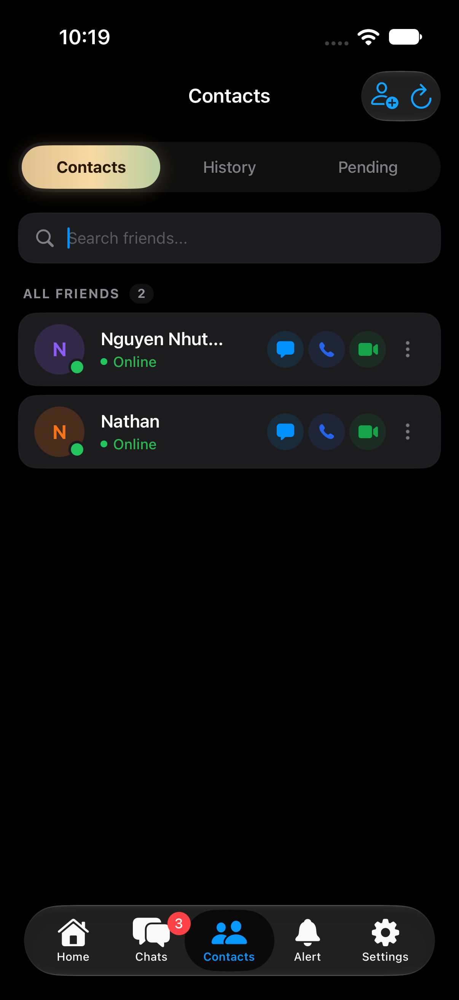

# Lotus Connect (iOS)

<p align="center">
  
  &nbsp;&nbsp;
  
  &nbsp;&nbsp;
  
</p>

<p align="center">
  <b>A modern, high-performance social messaging and stories client for iOS.</b><br/>
  Engineered with Point-Free’s <b>The Composable Architecture (TCA)</b> and <b>SwiftUI</b>.
</p>

---

## 📱 Screenshots

| Home Feed (Dark) | Home Feed (Light) | Full-Screen Story Player |
|:---:|:---:|:---:|
|  |  |  |

| Contacts |
|:---:|
|    |

---

## 🏗️ Architecture & Tech Stack

```
lotus_connect_ios/
├── App/
│   ├── Navigation/       # RootTabView, RootTabFeature, MainTab
│   ├── AppFeature.swift  # Top-level state coordinator
│   └── AppView.swift
├── Features/
│   ├── Home/             # Stories tray, full-screen story viewer, feed carousels
│   ├── Chat/             # Real-time message bubbles, WebSockets
│   ├── ChatList/         # Conversation threads and inbox
│   ├── Contacts/         # Contact directory, pending requests, search
│   ├── Auth/             # Session restoration, Keychain client, login/signup
│   └── Notifications/    # Activity and notifications feed
├── Domain/
│   └── Models/           # Post, Story, User, Message, Conversation entities
└── Core/
    ├── Network/          # URLSession HTTPClient abstractions
    └── Security/         # Keychain session storage
```

### Technology Matrix
- **UI Framework**: SwiftUI (iOS 17+)
- **State Management**: [The Composable Architecture (TCA)](https://github.com/pointfreeco/swift-composable-architecture) `v1.26.1`
- **Concurrency**: Native Swift Concurrency (`async`/`await`, `AsyncStream`, `@Sendable`)
- **Networking**: URLSession & WebSocket Task Engine
- **Image Loading**: Native `AsyncImage` with progressive caching and custom fallbacks
- **Security**: Keychain Services with biometrics support

---

## 🚀 Getting Started

### Prerequisites
- macOS Sonoma or later
- Xcode 16.0+ (iOS 17.0+ SDK)
- Simulator or physical iOS device

### Installation & Run

1. **Clone the repository:**
   ```bash
   git clone https://github.com/your-username/lotus_connect_ios.git
   cd lotus_connect_ios
   ```

2. **Open in Xcode:**
   ```bash
   open lotus_connect_ios.xcodeproj
   ```

3. **Resolve Swift Package Dependencies:**
   Xcode will automatically fetch Point-Free's dependencies (`swift-composable-architecture`, `swift-dependencies`, `swift-navigation`).

4. **Run the Project:**
   Select your desired simulator target (e.g. `iPhone 16 Pro` or `iPhone 17`) and press **Cmd + R**.

---

## 🤝 Pair Programming & Contributing

- Adheres to Point-Free TCA strict concurrency guidelines and Swift 6 language mode compatibility.
- Views observe state granularly through `@ObservableState` and `@Bindable`.
- Reducer actions follow explicit intent-based naming (`storyTapped`, `likeButtonTapped`, `refreshPulled`).